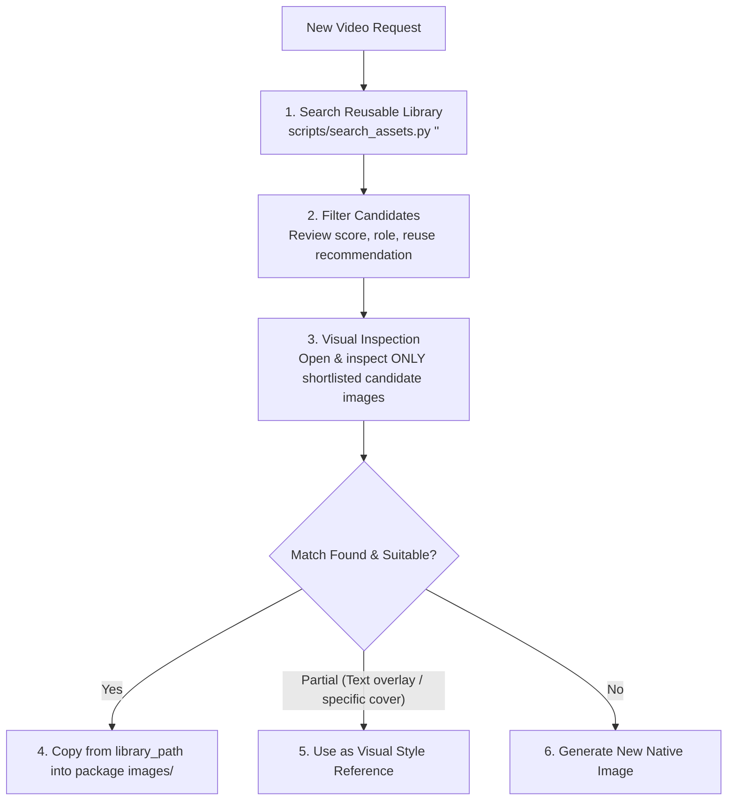

# AutoClip Reusable Asset Catalog & Library Standard

This document is the **single source of truth** for indexing, discovering, and reusing visual assets across AutoClip projects.

All agents, skills, and workflows must follow the rules defined here.

---

## 1. Permanent Reusable Asset Library Architecture

All reusable assets are stored permanently in the repository library at:

```text
/Users/zengcode/projects/autoclip/assets/reusable-library/
├── originals/            # De-duplicated, permanent master assets named by SHA-256
├── thumbnails/           # Lightweight, fast-loading thumbnails (<320px)
├── contact-sheets/       # Project-level visual contact sheets for rapid visual review
├── assets-index.jsonl    # Machine-readable, line-delimited JSON index
├── assets-index.md       # Human- and agent-readable summary catalog
└── catalog-state.json    # Fingerprint state tracking mtime/size for incremental builds
```

### Key Storage Guarantees
1. **Durable & Independent**: All assets in `assets/reusable-library/originals/` are real physical files, **never symlinks**. If an individual clip folder (e.g., `assets/some_past_reel/`) is archived or deleted, library assets remain 100% accessible.
2. **APFS Clone Copying**: On macOS APFS filesystems, files are copied using copy-on-write clone copies (`cp -c`). Clones take zero additional storage and copy virtually instantaneously. A fallback to standard copy exists for non-APFS environments.
3. **Deduplication by Content SHA-256**: If the exact same image exists in multiple projects, it is stored only once in `originals/{sha256}.{ext}`. The `assets-index.jsonl` record aggregates all source occurrences under `original_sources`.
4. **No Deletion on Source Cleanup**: When an original clip directory is cleaned up or deleted, its assets in `reusable-library/` **must never be deleted**. Removal from the library requires an explicit user command.
5. **Clean ZIP Packaging**: Files from `assets/reusable-library/` (`thumbnails/`, `contact-sheets/`, `assets-index.*`) must **NEVER** be packaged into release ZIP archives. When assembling a new video package, copy the needed image directly from `library_path` into the package's `images/` directory.

---

## 2. Mandatory Pre-Generation Workflow for Agents

Before generating any new images for a video project, agents **MUST** execute the following QA sequence:



### Mandatory Rules
1. **Search First**: Always search the catalog using `scripts/search_assets.py` or inspect `assets/reusable-library/assets-index.jsonl` before calling any image generator.
2. **Visual Inspection Gate**: Inspect only the top shortlisted candidate images (using `view_file`). Never assume an image matches solely because its tags or filenames match.
3. **Direct Reuse Criteria**: An asset may be used directly (`reuse_direct`) **ONLY IF**:
   - The topic, scientific/narrative meaning, and action match the script accurately.
   - The aspect ratio (e.g. 9:16 vertical) matches the target platform.
   - The brand matches (Mamase, Thai Java Zone, 12-Zodiac).
   - The image has **NO burned-in topic-specific text, headlines, or conflicting subtitles**.
4. **Scene 01 Protection**: Scene 01 images with topic-specific titles, hooks, or character arrangements are classified as `reuse_as_reference`. **Never reuse an old Scene 01 directly for a different topic**. Use it only as a composition/lighting reference, or generate a fresh native Scene 01 matching the permanent Mamase Scene 01 master standard.
5. **Brand Isolation**:
   - **Mamase** assets must never be used in Thai Java Zone or 12-Zodiac projects.
   - **12-Zodiac** templates in `assets/12ราศี/` are strictly isolated to the `/zodiac-weekly` workflow.
   - **Thai Java Zone** assets must strictly follow the engineering explainer style bible without Mamase branding.
6. **Generate Only When Necessary**: If no existing asset meets the required quality, meaning, and brand criteria, proceed to generate fresh master images following the project's quality baseline.

---

## 3. CLI Search & Indexing Commands

### Fast Local Search
```bash
# Search by topic or concept (supports both Thai and English)
.venv/bin/python scripts/search_assets.py "โดรนบน Titan บรรยากาศสีส้ม"
.venv/bin/python scripts/search_assets.py "black hole accretion disk" --limit 10

# Filter by role (content, hook, outro, branding)
.venv/bin/python scripts/search_assets.py "supernova" --role content

# Filter by reuse recommendation
.venv/bin/python scripts/search_assets.py "nebula" --reuse reuse_direct

# Filter by brand
.venv/bin/python scripts/search_assets.py "spacecraft" --brand mamase

# Output raw JSON for programmatic consumption
.venv/bin/python scripts/search_assets.py "solar wind" --json
```

### Catalog Building & Synchronization
```bash
# Incremental update (processes new/modified files, skips unchanged files)
.venv/bin/python scripts/build_asset_catalog.py

# Explicit incremental update
.venv/bin/python scripts/build_asset_catalog.py --incremental

# Full rebuild (re-evaluates all records, re-generates contact sheets)
.venv/bin/python scripts/build_asset_catalog.py --rebuild
```

---

## 4. Metadata Schema (`assets-index.jsonl`)

Each line in `assets/reusable-library/assets-index.jsonl` contains a single JSON record with:

| Field | Type | Description |
|---|---|---|
| `asset_id` | `string` | Content SHA-256 hash |
| `library_path` | `string` | Permanent path relative to repo root (e.g. `assets/reusable-library/originals/{sha256}.png`) |
| `thumbnail_path` | `string` | Lightweight preview path (e.g. `assets/reusable-library/thumbnails/{sha256}.jpg`) |
| `original_sources` | `list[str]` | List of all relative paths where this exact asset appears across projects |
| `source_project` | `string` | Primary project ID or directory name |
| `source_scene` | `string` | Scene ID or filename (e.g. `scene-01`, `03`) |
| `scene_number` | `string` | Normalized scene number (e.g. `01`, `02`) |
| `brand` | `string` | `mamase`, `12-zodiac`, `thai-java-zone`, or `generic` |
| `role` | `string` | `hook`, `content`, `outro`, `branding`, `raw artwork`, `reference` |
| `reuse` | `string` | `reuse_direct`, `reuse_as_reference`, or `do_not_reuse` |
| `topic` | `string` | Project topic or headline |
| `title` | `string` | Video title |
| `description` | `string` | Scene description or project summary |
| `visual_prompt` | `string` | Visual generation prompt from manifests/scripts |
| `narration` | `string` | Spoken narration corresponding to this scene |
| `tags` | `list[str]` | Keywords, topics, brand, and role tags |
| `width` | `int` | Pixel width |
| `height` | `int` | Pixel height |
| `format` | `string` | Image format (`PNG`, `JPEG`, `WEBP`) |
| `aspect_ratio` | `string` | Canonical aspect ratio (`9:16`, `16:9`, `1:1`, etc.) |
| `file_size_bytes` | `int` | Size on disk in bytes |
